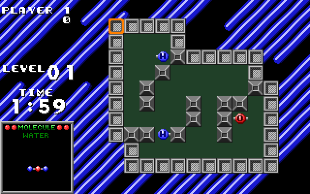
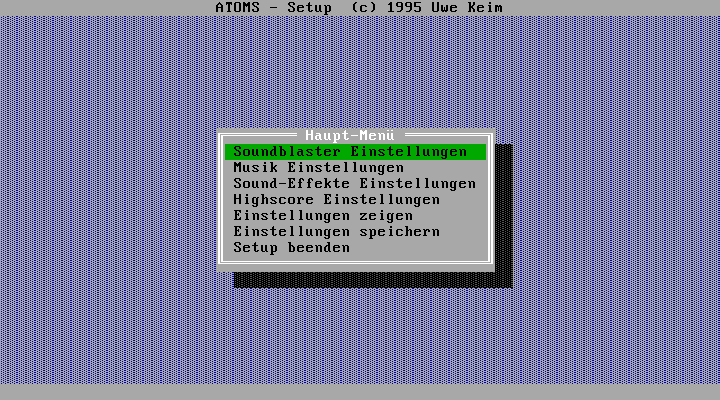

# Atoms

Back in 1995, I was 22 and I studied at our local university, I had programmed a computer game based on [the game "Atomix"](https://en.wikipedia.org/wiki/Atomix_(video_game)) in Turbo Pascal for MS-DOS. 

    
**[See YouTube video here](https://youtu.be/gdbhJfQu5CE)**

## Screenshots

Following are some screenshots of the game.

The splash/loading screen:

Level one in the game:

Level two in the game:

Asking the user whether he wants to quit:

The highscore board:

The external setup/configuration application, made with [Turbo Vision](https://en.wikipedia.org/wiki/Turbo_Vision).

Back then in the 1990s it was really fun to develop the game.

## Running the game

I recently made the game runnable again by installing it in a VirtualBox virtual machine with MS-DOS 6.22. 

I had to patch the executables because of a bug in the Turbo Pascal runtime/compiler for faster processors. See [this german c't article](https://www.heise.de/ct/hotline/Nicht-schon-wieder-Runtime-Error-200-307662.html) about details of the **Runtime Error 200**. Download the patching tool as "ctbppat.zip" from [this location](https://www.heise.de/ct/artikel/c-t-Systeminfo-2859100.html).

To play the game, locate the VirtualBox image in the "vm" sub folder and run it in VirtualBox.

Inside the MS-DOS machine, the game is located in the folder **"C:\uwekeim\atoms"**. Start the **"atoms.exe"** executable.
